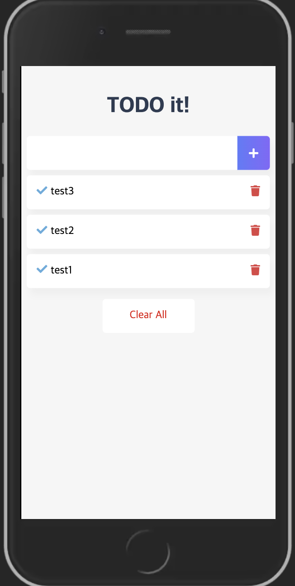

# 1. 프로젝트 생성 - cli

```bash
$ npm install -g @vue/cli

$ vue create vue-todo
 - default 선택 

$ cd vue-todo
$ npm run serve
```

# 2. 프로젝트 소개 및 컴포넌트 설계

## 2-1. 프로젝트


## 2-2. 컴포넌트

> 컴포넌트를 작게하는 경우 재사용성이 높아진다.

- TodoHeader: 제목
- TodoInput: 할일 타이핑하는 input
- TodoList: 할일 리스트 - 완료 유무, 리스트 제거
- TodoFooter: 모든 리스트를 없애는 버튼
- TodoSentiment: 오늘의 기분 설정 - 커스텀 컴포넌트 

# 3. 프로젝트 구현 순서
1. 컴포넌트 생성 
2. 파비콘, 아이콘, 폰트, 반응형 태그 설정 
    - 파비콘 생성: [https://www.favicon-generator.org/](https://www.favicon-generator.org/)
    - 반응형 웹(뷰포트): [https://www.w3schools.com/css/css_rwd_viewport.asp](https://www.w3schools.com/css/css_rwd_viewport.asp)
    - 아이콘(fontawesome): [https://fontawesome.com/](https://fontawesome.com/)
    - 구글 폰트(ubuntu): [https://fonts.google.com/specimen/Ubuntu](https://fonts.google.com/specimen/Ubuntu)
3. 각 컴포넌트 구현
4. 애플리케이션 구조 개선하기 (vuex의 축소 구조)
    - App.vue: 해당 뷰에서 모두 데이터를 관리 - 컨테이너 컴포넌트 역할
    - 다른 컴포넌트: App.vue의 하위 컴포넌트 
    - 하위 <-> 상위 데이터를 전달하기 위해 emit과 props 사용 
5. 사용자 경험 개선 
    - 모달 추가: slot 사용법 : https://kr.vuejs.org/v2/examples/modal.html
    - 트랜지션 구현: https://vuejs.org/v2/guide/transitions.html#List-Entering-Leaving-Transitions

6. ES6 
 - ES6란? react, angular, vue에서 권고하는 언어 형식. ES5에 비해 문법이 간결함. 
- ES5 특징 - 변수의 scope
```javascript
    var sum = 0;
    for(var i = 1; i <= 5; i++){
        sum = sum + i;
    }
    console.log(sum); // 15
    console.log(i);  //6 var는 전역이라 접근이 가능 
```

- ES5 특징 - Hoisting
    - 함수 선언식과 변수를 위한 메모리 공간을 위로 끌어올린다. 
```javascript
    var sum =5;    // 1
    sum = sum + i;  // 4
    function sumAll(){}   // 2
    var i = 10;   // 3
```
 - babel: ES6 문법 > ES5 문법으로 변환하는 컴파일러. ES6의 기능을 지원하지 않는 브라우저가 있음. https://babeljs.io/ 
    - const & let
     - const: 한번 선언한 값에 대해서 변경할 수 없음(상수). 객체나 배열은 가능 
        ```javascript
        const a = {};
        a.num = 10;
        const b = [];
        b.push(200);
        const c = 10;
        c = 20;
        ```
     - let: 한번 선언한 값에 대해서 다시 선언 못함. 재할당은 가능 
        ```javascript
        let sum = 0;
        for (let i = 1; i <= 5; i++){
            sum = sum + i;
        }
        console.log(sum);   // 10
        console.log(i);    // i is not defined
        ```
    - Arrow Fuction(화살표 함수): function 대신 => 로 설정한다. 
        - babel 온라인 에디터 확인:  https://babeljs.io/repl/
        ```javascript
        // ES5 함수 정의 방식 
        var sum = function(a, b) {
            return a + b;
        }
        // ES6 함수 정의 방식 
        var sum = (a, b) => {
            return a + b;
        }
        ```
        ```javascript
        // ES5 함수 정의 방식 
        var arr = [1, 2, 3];
        arr.forEach(funtion(value) {
            console.log(value);
        });
        // ES6 함수 정의 방식 
        var arr = [1, 2, 3];
        arr.forEach(value => {
            console.log(value);
        });
        ```
    - Enhanced Object Literals(향상된 객체 리터럴): :fuction 제거 가능. 같은 속성명 축약 가능(하나로 가능) 
        ```javascript
            // ES5 메서드 정의
            var dictionary = {
                lookup: fuction() {
                    // 함수 정의 
                }
            }
            
            // ES6 메서드 정의 
            var dictionary = {
                lookup() {
                    // 함수 정의 
                }
            }
            
            });
            ```
    - Modules: 변수의 중복이나 재사용에 좋음 
        - default: import 이름을 원하는 이름으로 부여 가능하도록 함.
# 4. Vuex - 상태 관리 라이브러리 
 - vuex 설치 : https://vuex.vuejs.org/kr/installation.html
 - vuex 기술 요소
    - state: data 
    - getters
    - mutations: state(data)를 변경하는 메소드. commit 명령어로 메소드 실행 
    - actions: 비동기 처리 로직 